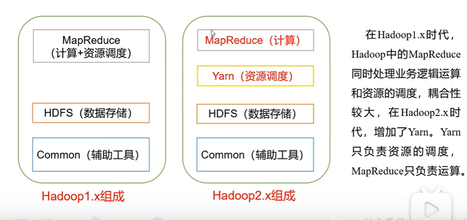
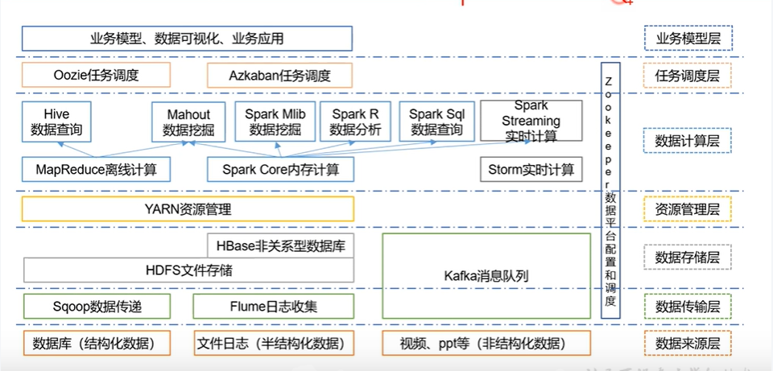

# 大数据概述--尚硅谷
## 大数据简介
1. **大数据(BigData)概念:**
指==无法在一定时间范围==内使用常规软件工具进行捕捉、管理和处理的数据集合，是需要新处理模式才能具有更大的决策力、洞察发现力和流程优化能力的==海量、高增长率和多样化==的信息资产
2. **数据存储单位**
 bit Byte KB MB GB ==TB PB EB== ZB YB BB NB DB
> 1Byte = 8bit
> 1K = 1024 Byte
> 1MB = 1024K
> 1G = 1024M
> 1T = 1024G
> 1P =1024T

3. **主要解决的问题**：
海量数据的==存储==和海量数据的==分析计算问题==

## 大数据特点 
1. Volume（大量）
    数据体量庞大，从TB级别跃升到PB级别，一些大企业的数据量已经接近EB级。
2. Variety（种类来源多样化）
    种类：结构化，半结构化、非结构化数据  
	+ 结构化数据：以数据库/文本为主的结构化数据
	+ 非结构化数据：包括网络日志、音频、视频、图片、地理位置信息等
3. Value（价值密度低）
	低价值密度： 信息海量，有价值的低，需要数据挖掘  
4. velocity （高速）
	框架处理大数据 速度快，比传统的MySql快很多
5. veracity  
	数据的准确性和可信赖，即数据的质量

## 应用场景
1. 电商方面
**精准广告位:**通过对用户的浏览行为、点击行为进行大数据采集，分析，挖掘用户的二层三层喜欢，扩大产出。
2. 传媒方面
**猜你喜欢:**通过对受众人群机型大数据分析，结合对应算法，对受众喜欢的进行交互推荐。
3. 金融领域
**理财投资:**通过对个人的信用评估，风险承担能力评估，集合众多理财产品，推荐相应的投资理财产品。
4. 交通方面
+  **估算车流量** 进行合理道路规划
+ **利用大数据实现即时信号灯调控** 提高线路通行能力
5. 电信方面
**移动，联通推荐套餐** 通过用户当前的行为习惯
6. 安防方面
人脸识别
7. 医疗方面
**智慧医疗** 通过对海量病例大数据的存储，匹配，检索，结合用户的饮食，行为等习惯，搭建智慧医疗体系。

## 大数据业务分析步骤

## Hadoop 
1. 简介
+ Hadoop是一个由Apache基金会所开发的分布式系统基础架构
+ 主要解决 海量数据的==存储==与海量数据的分析==计算==问题
    + 存：HDFS  分布式文件系统
    + 算：MapReduce 分布式运算编程框架

2. 优点
+ 高可靠性：Hadoop底层维护多个数据副本，即使丢失某个计算元素，不会导致数据丢失
+ 高扩展性：在集群间分配任务数据，可方便的扩展数以千计的节点
+ 高效性：并行工作，加快任务处理速度
+ 高容错性：能够自动将失败的任务重新分配

3. 组成

+ HDFS架构（分布式文件系统）
	+ NameNode(nn) 数据索引 存储文件的目录结构、属性、以及每个文件所在的DataNode
	+ DataNode(dn) 数据本身
	+ Secondary NameNode(2nn) 
+ Yarn（运算资源调度系统） 
+ MapReduce（分布式运算编程框架）

+ **Apache Hadoop**：是Apache开源组织的一个分布式计算开源框架，提供了一个分布式文件系统子项目(HDFS)和支持MapReduce分布式计算的软件架构。
+ **Apache Hive**：是基于Hadoop的一个数据仓库工具，可以将结构化的数据文件映射为一张数据库表，通过类SQL语句快速实现简单的MapReduce统计，不必开发专门的MapReduce应用，十分适合数据仓库的统计分析。
+ Apache Pig：是一个基于Hadoop的大规模数据分析工具，它提供的SQL-LIKE语言叫Pig Latin，该语言的编译器会把类SQL的数据分析请求转换为一系列经过优化处理的MapReduce运算。
+ Apache HBase：是一个高可靠性、高性能、面向列、可伸缩的分布式存储系统，利用HBase技术可在廉价PC Server上搭建起大规模结构化存储集群。
+ Apache Sqoop：是一个用来将Hadoop和关系型数据库中的数据相互转移的工具，可以将一个关系型数据库（MySQL ,Oracle ,Postgres等）中的数据导进到Hadoop的HDFS中，也可以将HDFS的数据导进到关系型数据库中。
+ Apache Zookeeper：是一个为分布式应用所设计的分布的、开源的协调服务，它主要是用来解决分布式应用中经常遇到的一些数据管理问题，简化分布式应用协调及其管理的难度，提供高性能的分布式服务。
+ Apache Mahout：是基于Hadoop的机器学习和数据挖掘的一个分布式框架。Mahout用MapReduce实现了部分数据挖掘算法，解决了并行挖掘的问题。
+ Apache Cassandra：是一套开源分布式NoSQL数据库系统。它最初由Facebook开发，用于储存简单格式数据，集Google BigTable的数据模型与Amazon Dynamo的完全分布式的架构于一身。
+ Apache Avro：是一个数据序列化系统，设计用于支持数据密集型，大批量数据交换的应用。Avro是新的数据序列化格式与传输工具，将逐步取代Hadoop原有的IPC机制
+ Apache Ambari：是一种基于Web的工具，支持Hadoop集群的供应、管理和监控。
+ Apache Chukwa：是一个开源的用于监控大型分布式系统的数据收集系统，它可以将各种各样类型的数据收集成适合 Hadoop 处理的文件保存在 HDFS 中供 Hadoop 进行各种 MapReduce 操作。
+ Apache Hama：是一个基于HDFS的BSP（Bulk Synchronous Parallel)并行计算框架, Hama可用于包括图、矩阵和网络算法在内的大规模、大数据计算。
+ Apache Flume：是一个分布的、可靠的、高可用的海量日志聚合的系统，可用于日志数据收集，日志数据处理，日志数据传输。
+ Apache Giraph：是一个可伸缩的分布式迭代图处理系统， 基于Hadoop平台，灵感来自 BSP (bulk synchronous parallel) 和 Google 的 Pregel。
+ Apache Oozie：是一个工作流引擎服务器, 用于管理和协调运行在Hadoop平台上（HDFS、Pig和MapReduce）的任务。
+ Apache Crunch：是基于Google的FlumeJava库编写的Java库，用于创建MapReduce程序。与Hive，Pig类似，Crunch提供了用于实现如连接数据、执行聚合和排序记录等常见任务的模式库
+ Apache Whirr：是一套运行于云服务的类库（包括Hadoop），可提供高度的互补性。Whirr学支持Amazon EC2和Rackspace的服务。
+ Apache Bigtop：是一个对Hadoop及其周边生态进行打包，分发和测试的工具。
+ Apache HCatalog：是基于Hadoop的数据表和存储管理，实现中央的元数据和模式管理，跨越Hadoop和RDBMS，利用Pig和Hive提供关系视图。
+ Cloudera Hue：是一个基于WEB的监控和管理系统，实现对HDFS，MapReduce/YARN, HBase, Hive, Pig的web化操作和管理。
+ Cloudera Impala：高性能的SQL引擎（提供类似RDBMS的体验），提供了访问存储在Hadoop分布式文件系统中的数据的最快方法。

# 大数据技术生态体系

目前 所有数据存储基于HDFS 

**HBase** 

Hbase是Hadoop项目的子项目，是一个分布式的、面向列的NoSQL数据库，虽然不是基于MapReduce，但是也是可以存储、处理大规模的数据，是Hadoop家族重要的一员。HBase 底层依旧依赖 HDFS 来作为其物理存储

资源管理
计算引擎：MapReduce， Spark Core

> Spark core相比与MR,计算速度更快,特别是迭代运算,提供众多算子和支持多种语言,通用性上也更好

计算引擎包装后==>

+ Hive是一个基于HDFS的数据仓库工具，可以将Hive SQL转化为MapReduce进行数据处理查询的工具
+ Mathout 数据挖掘
+ Spark MIib 数据挖掘
+ Spark R 数据分析
+ Spark Sql 数据查询 本质=> 通过写sql方式  进行 Spark Core 查询
+ Spark Streaming实时计算（在线计算） Flink 纯流式计算

# 相关专业术语

+ 垂直搜索：针对某一个行业的专业搜索引擎，是搜索引擎的细分和延伸，是对网页库中的某类专门的信息进行一次整合，定向分字段抽取出需要的数据进行处理后再以某种形式返回给用户。特点就是“专、精、深”，且具有行业色彩，相比较通用搜索引擎的海量信息无序化，垂直搜索引擎则显得更加专注、具体和深入。

+ 成交金额（Gross Merchandise Volume）简称GMV。

+ 归一化用户登录帐号
  通过首购订单信息，参考绑定手机号，首购订单收货手机号，WX，SQ，一手机多账号，进行全站用户归一

+ 父订单，子订单
  顾客从购物车选中多件商品下单的时候，会生成一个父订单和多个子订单。一般子订单拆分的规则是按照店铺，每个店铺一张子订单，如果其中有店铺是自营的，可能会将该店铺的商品按照发货仓库提前拆分成多个子订单。
  **子订单**是后续追踪发货物流、售后以及财务结算的依据。包括订单明细、商品明细、支付明细、收货信息、发票信息、服务信息、物流信息、发货信息等各种内容。
  **父订单**除了记录用户这一次下多单的行为，还有合并支付。如果有跨商家优惠，父订单可以对应到相应的优惠，然后对各个商家进行摊分。一般在用户下完单之后，父订单的作用基本上是已经完成了。在订单产品架构的设计中，并不是需要拆单的订单才有父订单，而是所有的订单都需要生成父子订单。

+ 用户
	+  新用户的定义是第一次消费。
	+  活跃用户即老客，在某一个时间窗口内有过消费。
	+  不活跃用户则是时间窗口内没有消费过的老客。
	+  回流用户是在上一个窗口中没有消费，而在当前时间窗口内有过消费。 
	
+ 统计口径：是指统计数据所采用的标准

+ POP商家（Platform Open Plan）第三方卖家：
	+ 第三方卖家借用京东平台来销售商品，跟淘宝开店一个意思。京东POP平台区别于京东自营。京东自营就是京东自己进货，自己销售，自己配送。
	+ POP的货基本上直接由第三方卖家发货。京东POP平台之于商家是一个重要的渠道
	
+ SOP（Sales On platform）自营平台
	
	+ 是卖家在京东销售商品，卖家每日将消费者订单打包并自行或采用快递完成购物订单配送，卖家开发票给消费者（卖家可在众多快递中，选择京东快递做货到付款业务并享受专业的配送服务体验）

+ 流量：网站的访问量

  指标

	+ uv (unique visitor)独立访客数，指访问某个站点或点击某条新闻的不同IP地址的人数。在同一天内，uv只记录第一次进入网站的具有独立IP的访问者，在同一天内再次访问该网站则不计数。
	+ rv（repeat visitors）：重复访客,不同用户，访问同一网页或产品的重复触发用户数。
	+ pv（pageview）页面访问量，页面浏览量/点击量；是衡量一个网络新闻频道、网站、网络新闻的主要指标；
	+ IP数：IP数是访问这个网站的不同IP地址的总数
	+ 人均访问页面：PV总和除以IP，即可获得每个人平均访问的页面数量。至少人均访问页面需要超过10个以上，才算是优质的用户；

  活动流量：活动的访问量

+ spu 属性(不会影响到库存和价格的属性, 又叫**关键属性**) 

+ sku 属性(会影响到库存和价格的属性, 又叫**销售属性**) 

+ CPS(Cost Per Sale)：以实际销售产品数量来换算广告刊登金额。就是第三方帮助商家销售产品，赚取一定的佣金。例如宣称“网购不领券，白花冤枉钱”的APP

+ 虚拟订单 
  虚拟订单是指不需要物流发货，商品是虚拟物品的订单。商品可以是充值、服务产品点卡、礼品卡等，相比实物订单，虚拟订单由于没有物流状态，所以订单流转和结算流程相对简单一些。

+ 开普勒订单
  开普勒项目：帮助品牌入驻小程序

+ 地址线级
  一线、二线

+ 数据集市

  数据集市(Data Mart) ，也叫数据市场，数据集市就是满足特定的部门或者用户的需求，按照多维的方式进行存储，包括定义维度、需要计算的指标、维度的层次等，生成面向决策分析需求的数据立方体。

